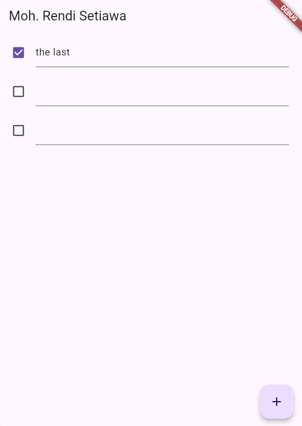

## Tugas_Praktikum_1

1. Dokumentasikan langkah-langkah dan hasil akhir (GIF)
Langkah-langkah sudah dijelaskan dan dijalankan sesuai praktikum:

Membuat task.dart untuk model tugas.
Membuat plan.dart untuk daftar tugas.
Menyusun data_layer.dart untuk mengelola ekspor model.
Implementasi main.dart dengan MaterialApp.
Membuat plan_screen.dart untuk layar daftar rencana.
Menambahkan scroll controller dan lifecycle methods (initState, dispose).

2. Langkah 4 membuat file data_layer.dart yang mengumpulkan semua model (task.dart dan plan.dart) agar lebih mudah diimpor ke file lain dalam satu langkah.

3. Variabel plan di langkah 6 menyimpan data tugas utama yang akan ditampilkan dan diubah di aplikasi. Dibuat sebagai const Plan() untuk inisialisasi awal agar datanya tetap kosong sebelum diisi.

4. 

5. Langkah 11 (initState): Inisialisasi scrollController dan listener untuk menghilangkan fokus TextField saat scroll (berguna untuk keyboard di iOS). Langkah 13 (dispose): Membersihkan scrollController agar tidak ada kebocoran memori.
